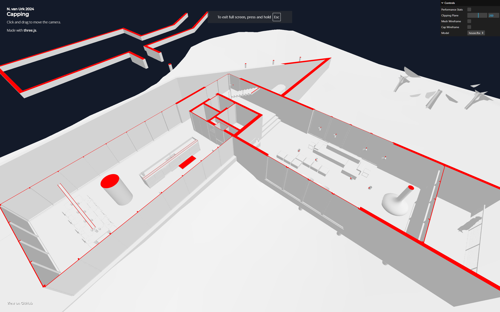

# [Capping](https://nickvanurk.com/capping/)

An efficient algorithm for clipping and capping solid triangle meshes, based on the approach described in this [paper](docs/paper.pdf)



## :blush: **Why?**

This project was developed to address a common challenge in 3D graphics: efficiently clipping and capping solid triangle meshes. Such operations are crucial for applications like 3D printing and architectural visualization, where accurate, watertight models are essential.

As part of my personal portfolio, this project demonstrates my ability to implement advanced geometric algorithms and apply them using modern 3D graphics technologies like Three.js. It also highlights my problem-solving skills and my ability to create optimized solutions for real-world applications.

By working on this, I aimed to refine my understanding of geometric algorithms while adding a practical and visually compelling piece to my portfolio.

## :rocket: Technologies Used

- Three.js
- TypeScript
- HTML/CSS

## Getting Started

These instructions will get you a copy of the project up and running on your local machine.

### Prerequisites

- [Git](https://git-scm.com/book/en/v2/Getting-Started-Installing-Git)
- [Node.js](https://nodejs.org/en/download/package-manager/)
- [npm](https://www.npmjs.com/get-npm)

### Installation

```
$ git clone https://github.com/nickyvanurk/capping
$ cd ./capping
$ npm i
$ npm run dev
```
